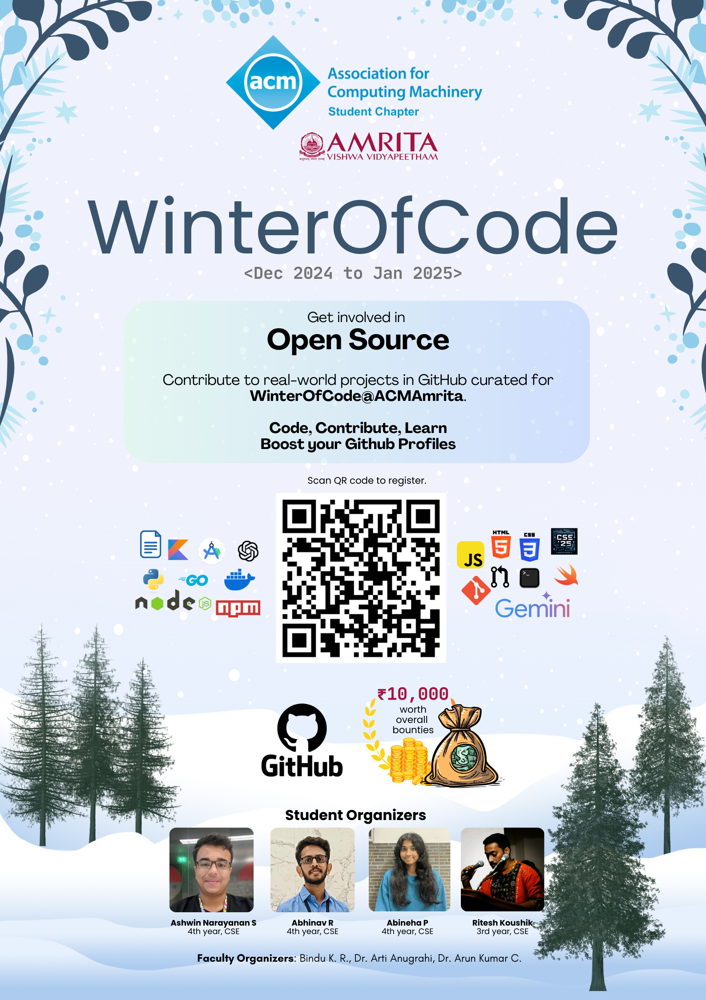

# :snowflake: Winter of Code@ACMAmrita - Season 01 :tada:

> [!Note]
> This competition is purely for `Amrita Vishwa Vidyapeetham, Coimbatore` students only. All repositories are maintained by `students` of Amrita Vishwa Vidyapeetham, Coimbatore.

Join us for `Winter of Code @ ACM, Amrita Coimbatore` `2024-25`, a unique opportunity to dive 
headfirst into the world of open-source development. Collaborate with brilliant 
minds, contribute to real-world projects and turbocharge your coding skills. :chart_with_upwards_trend:

## Things to Look Forward To :dizzy:

#### 1. Orientation Session

| Date | Time | Mode | 
| ---- | ---- | ---- |
| TBD | TBD | `Online` |

#### 2. Code Review Livestreams

| Date | Time | Mode | 
| ---- | ---- | ---- |
| TBD | TBD | `Online` |

## 10 Rules for This Winter :memo:

Essential guidelines for contributing to :snowflake: Winter of Code @ ACM Amrita 2024-25. Failing to follow thses will lead to disqualification from the competition.

1. **GitHub Account**: Ensure you have an active personl GitHub account.
2. **Registration Form**: Fill out the [registration form](https://forms.office.com/r/xH6GzZZhzC) with valid credentials. This will be used to track your progress and give out rewards.
3. **Descriptive Commit Messages**: Write clear and concise commit messages that explain the changes made.
4. **One Issue at a Time**: Focus on completing one issue before requesting to be assigned to another.
5. **AI Tool Usage**: The use of AI tools is permitted, but excessive reliance on AI-generated code may lead to rejection.
6. **Eligibility Criteria**: Adhere to the eligibility criteria outlined in each issue.
7. **Original Code**: Avoid using copyrighted code. Please be honest to yourself.
8. **Code Review**: The final decision on reward allocation rests with the maintainers.
9. **Issue Labeling**: Maintainers will label issues to indicate their eligibility for the program. New issues can be added but they can be worked upon post-approval.
10. **Contribution Guidelines**: Read the `CONTRIBUTION.md` file present in each project carefully before contributing to the project.

## Index of Projects :bento:
#### 1. Quick Start Express
Description under construction :construction:    
**Tech Stack:**

#### 2. Amrita-PYQ Command Line Tool
Description under construction :construction:    
**Tech Stack:**

#### 3. Amrita-Map App
Description under construction :construction:    
**Tech Stack:**

#### 4. Match-da-Pairs Mobile App
Description under construction :construction:    
**Tech Stack:**

#### 5. Google Maps Kotlin Plugin
Description under construction :construction:    
**Tech Stack:**

#### 6. Placement Tracker Web and Server
Description under construction :construction:    
**Tech Stack:**

#### 7. TaskShogun - CLI Kanban Board
Description under construction :construction:    
**Tech Stack:**

#### 8. Data Structures and Algorithms (All Languages)
Description under construction :construction:    
**Tech Stack:**

#### 9. Bluedis - A Homegrown Redis
Description under construction :construction:    
**Tech Stack:**

#### 10. Timetable Progressive Web App
Description under construction :construction:    
**Tech Stack:**

## Meet your Maintainers :building_construction:
1. [Ashwin Narayanan S - 4th Year, CSE](https://github.com/Ashrockzzz2003)
2. [Abhinav Ramakrishnan - 4th Year, CSE](https://github.com/Abhinav-ark/)
3. [Shreyas Visweshwaran - 4th Year, CSE](https://github.com/FirefoxSRV)
4. [Abineha Prabhu - 4th Year, CSE](https://github.com/abineha)
5. [Hariharan - 4th Year, CSE](https://github.com/Hariharan-Arul)
6. [Ritesh Koushik - 3rd Year, CSE](https://github.com/IAmRiteshKoushik)
